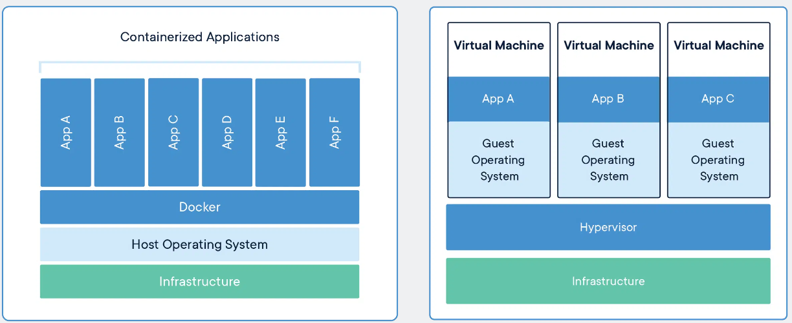
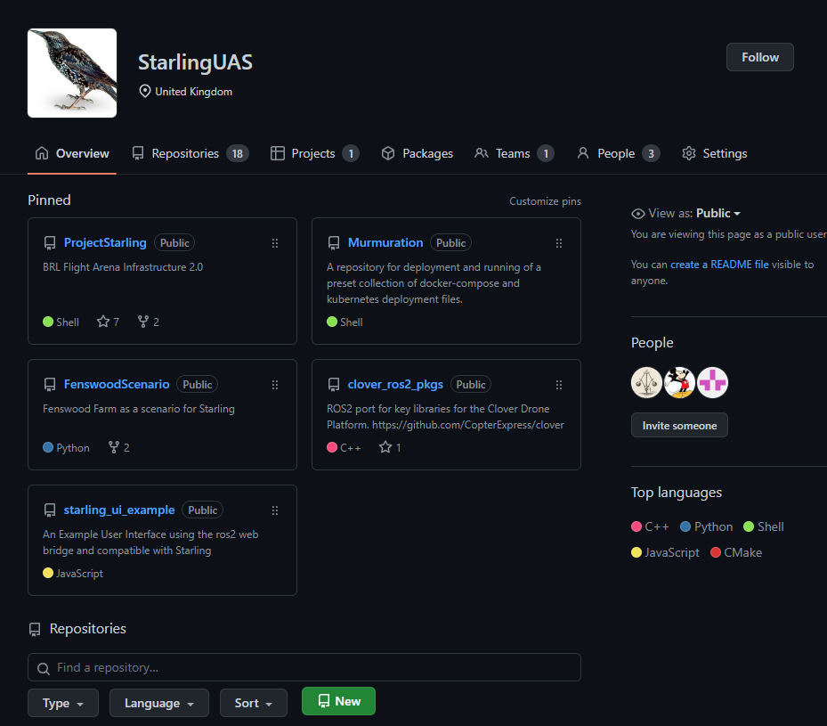
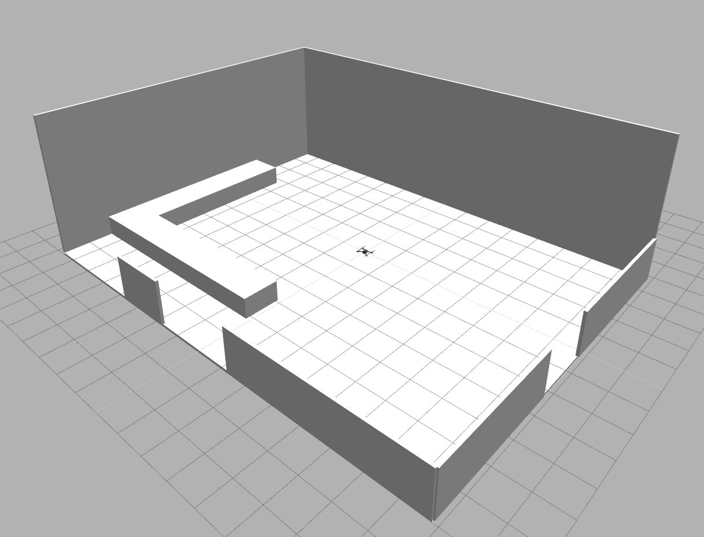

# Docker and Containerisation

This tutorial gives a brief introduction to a key element of Starling - containerisation. By the end you will hopefully have an idea of what containerisation is, what docker is, how to use it, and how we use it within Starling.

> This is adapted from the [Duckietown Docker Docs](https://docs.duckietown.org/DT19/software_devel/out/docker_intro.html), [Docker Docs tutorial](https://docs.docker.com/get-started/), and a number of other resources.

[TOC]

## Introduction

### What is Containerisation and Docker

It would be nice to give a computer - any computer with an internet connection - a short string of ASCII characters (say via a keyboard), press enter, and return to see some program running. Forget about where the program was built or what software you happened to be running at the time (this can be checked, and we can fetch the necessary dependencies). Sounds simple, right? In fact, this is an engineering task that has taken thousands of the world’s brightest developers many decades to implement.

Thanks to the magic of container technology we now can run any Linux program on almost any networked device on the planet, as is. All of the environment preparation, installation and configuration steps can be automated from start to finish. Depending on how much network bandwidth you have, it might take a while, but that’s all right. All you need to do is type the string correctly.

Docker is one very widely used example of containerisation technology, and the one we make use of in Starling. They provide a large number of tools and programs to help us contain, develop, test and deploy our containers to the real world.

If you followed the [getting started](getting_started.md), you should hopefully have done the full docker install. If not, you can run the following command from a linux command line to install basic docker.

```
 curl -sSL https://get.docker.com/ | sh
```

### Docker Concepts in more detail

> Adapted from [Docker Resources](https://www.docker.com/resources/what-container/)

A **container** is a standard unit of software that packages up code and all its dependencies so the application runs quickly and reliably from one computing environment to another. A Docker container image is a lightweight, standalone, executable package of software that includes everything needed to run an application: code, runtime, system tools, system libraries and settings.

Container **images** become containers at runtime and in the case of Docker containers – images become containers when they run on Docker Engine. Available for both Linux and Windows-based applications, containerized software will always run the same, regardless of the infrastructure. Containers isolate software from its environment and ensure that it works uniformly despite differences for instance between development and staging.

Containers are *Standard* (can run anywhere), *Lightweight* (Share low level machine system and not the whole Operating System) and *Secure* (Each application is as isolated as possible). For us this also translates to providing *Reproduceable* and *Reusable* systems.



On the left, Containers are an abstraction at the app layer that packages code and dependencies together. Multiple containers can run on the same machine and share the OS kernel with other containers, each running as isolated processes in user space. Containers take up less space than VMs (container images are typically tens of MBs in size), can handle more applications and require fewer VMs and Operating systems.

On the right, Virtual machines (VMs) are an abstraction of physical hardware turning one server into many servers. The hypervisor allows multiple VMs to run on a single machine. Each VM includes a full copy of an operating system, the application, necessary binaries and libraries – taking up tens of GBs. VMs can also be slow to boot.

### Starling Container Ecosystem

The purpose of Starling is to allow you to quickly and easily install and run a UAV simulation within a simulated environment, so that you can test your developed controllers against a semi-realistic scenario, to then test in the real world

Therefore Starling is a set of pre-built programs/executables, some of which are pre-configured for the following:

- Running a Physics Simulation with Visualisation
- Running the Drone autopilot control software locally (a.k.a Software In The Loop or SITL)
- Running the interface between Mavlink and other protocols such as the Robot Operating System (ROS)
- And many others...

These pre-built containers are all available in the [StarlingUAS repository on github](https://github.com/StarlingUAS) and on Docker Hub.

Together these containers form a modular ecosystem of drone systems which can be composed together to develop software for real drones. Any controllers developed via the simulator can be directly ported to run on a real drone.



## Using Docker with Starling

### Getting and Running Containers

Every docker container is registered to a developer or organisation. In Starling, our docker organisation is known as [`uobflightlabstarling`](https://hub.docker.com/orgs/uobflightlabstarling). Within our organisation, we have a large number of Docker **containers** available. These Docker containers live inside [**container registries**](https://hub.docker.com/orgs/uobflightlabstarling/repositories) (such as DockerHub), which are servers that host Docker images. A Docker **image** is one particular version or snapshot of a container and is basically a filesystem snapshot - a single file that contains everything you need to run our container.

You can manually fetch one of our core containers called `starling-mavros` from docker hub using:

```bash
docker pull uobflightlabstarling/starling-mavros
```

You can also try and pull one of our simulation containers:

```bash
docker pull uobflightlabstarling/starling-sim-iris-px4-flightarena:latest
```

This might take a few minutes to download depending on internet connection (some containers like the simulation can be quite big!). Once downloaded, to see a list of Docker images on your machine, run:

```bash
docker images
```

Every image has an image ID, a name and a tag

```text
REPOSITORY                                                              TAG               IMAGE ID       CREATED         SIZE
uobflightlabstarling/starling-sim-iris-px4-flightarena                  latest            62d7f96637cf   3 weeks ago     5.97GB
uobflightlabstarling/starling-mavros                                    latest            b70812c16731   5 months ago    2.06GB
```

To run a Docker container, type the repository name, like so:

```bash
docker run uobflightlabstarling/starling-mavros
# Or with the tag if you want to run a specific tag (version) of that container
docker run uobflightlabstarling/starling-mavros:latest
```

In another terminal, you can see what is currently running using:

```text
docker ps
CONTAINER ID   IMAGE                                  COMMAND                  CREATED          STATUS          PORTS     NAMES
4fd1e0948f23   uobflightlabstarling/starling-mavros   "/ros_entrypoint.sh …"   46 seconds ago   Up 45 seconds             vigilant_nobel
```

Note how your the running container has a *container ID*, a base image you ran, and at the end, a funny name *vigilant_noble*. This funny name is an alias for the container ID.

To stop the container, simply press `ctrl+c` in the terminal which you ran `docker run`.

As a second example, you can similarly try and run the simulator, this time also specifying a port mapping to let you see the simulator in your web-browser.

```bash
docker run -p 8080:8080 uobflightlabstarling/starling-sim-iris-px4-flightarena
```

Then you can navigate to `localhost:8080` in your web browser to see the simulator. You should hopefully see something like the following:



You can use the cursor to move around the environment, we will be coming back to the simulator in a [later section](simulation.md).

To stop the simulator, you can try and use `ctrl+c`, but sometimes this doenst work. Another way is to first get the container ID or name like before:

```text
docker ps
CONTAINER ID   IMAGE                                                    COMMAND                  CREATED         STATUS         PORTS                                         NAMES
6a4bd538118c   uobflightlabstarling/starling-sim-iris-px4-flightarena   "/entrypoint.sh ros2…"   2 minutes ago   Up 2 minutes   7681/tcp, 11345/tcp, 0.0.0.0:8080->8080/tcp   trusting_diffie
```

See how the name is `trusting_diffie` with ID `6a4bd538118c`.

You can then explicitly stop the container by running (it can sometimes take a minute).

```bash
docker stop trusting_diffie
# or
docker stop 6a4bd538118c
```

Dont forget to also remove the container afterwards

```bash
docker rm trusting_diffie
# or
docker rm 6a4bd538118c
```

### Creating Containers

To create a Docker image we write a recipe, called a *Dockerfile*. A *Dockerfile* is a text file that specifies the commands required to create a Docker image, typically by modifying an existing container image using a scripting interface. They also have special keywords (which are always CAPITALIZED), like `FROM`, `RUN`, `ENTRYPOINT` and so on. For example, create a file called Dockerfile with the following content:

```text
FROM ros:foxy       # Defines the base image
RUN touch new_file1   # new_file1 will be part of our snapshot
CMD ls -l             # Default command to be run when the container is started
```

Now, to build the image we can simply run:

```bash
docker build -t your/duck:v3 .       # Where '.' is the directory containing your Dockerfile
```

You should see something like:

```text
Sending build context to Docker daemon  2.048kB
Step 1/3 : FROM uobflightlabstarling/starling-mavros
 --- ea2f90g8de9e
Step 2/3 : RUN touch new_file1
 --- e3b75gt9zyc4
Step 3/3 : CMD ls -l
 --- Running in 14f834yud59
Removing intermediate container 14f834yud59
 --- 05a3bd381fc2
Successfully built 05a3bd381fc2
Successfully tagged your/duck:v3
```

Now run the command docker images in your terminal, and you should see an image called your/duck with tag v3:

```text
docker images
REPOSITORY                                                              TAG               IMAGE ID       CREATED         SIZE
your/duck                                                               v3                ea2f90g8de9e   1 minute ago    2.06GB
uobflightlabstarling/starling-sim-iris-px4-flightarena                  latest            62d7f96637cf   3 weeks ago     5.97GB
uobflightlabstarling/starling-mavros                                    latest            b70812c16731   5 months ago    2.06GB
```

This procedure is identical to the snapshot method we performed earlier, but the result is much cleaner. Now, instead of needing to carry around a 2.06GB BLOB, we can just store the 4KB text file and rest assured that all our important setup commands are contained within. Similar to before, we can simply run:

```text
docker run -it your/duck:v3
total 0
-rw-r--r-- 1 root root 0 May 21 21:35 new_file1
```

Notice that as soon as we run the container, Docker will execute the ls -l command as specified by the Dockerfile, revealing new_file1 was stored in the image. However we can still override ls -l by passing a command line argument:

```bash
docker run -it your/duck:v3 [custom command]
```

In the next tutorial, we will go into more detail in how these Dockerfiles are constructed for us.

### Layer Caching

An important concept in Docker is the *layers*. In the previous section you may think that every time we build, we end up having to copy over the entire parent container. e.g. your/duck:v3 takes up another 2Gb of storage space! In actual fact, it (thankfully) does not, because under the hood the executable does not exist as one giant individible binary. It is in fact split into multiple independnet layers which can be shared in between images!

> Essentially each `RUN` line in your Dockerfile is compiled into a new layer placed upon the previous layers.

This is helpful as if you try to build your container again, unless you change something, those previous layers are *cached* by Docker to be used instead of rebuilding the entire thing from scratch!

### Inspecting a container

One of the downsides of containers is that manipulating files and inspecting the their state is not as simple. Previously, you could just browser through your own file system and check things. Now that a container has its own file system, its not as clear how you could check things have been set up correctly, or test run commands manually or similar.

There are a number of different ways, but the simplest way is to `exec` into a running container. As an example, you can run `starling-mavros` again in one terminal.

```bash
docker run uobflightlabstarling/starling-mavros
```

In another terminal, identify the container ID or name by using `docker ps`

```text
CONTAINER ID   IMAGE                                  COMMAND                  CREATED         STATUS         PORTS     NAMES
81b7dfb6c443   uobflightlabstarling/starling-mavros   "/ros_entrypoint.sh …"   3 seconds ago   Up 2 seconds             angry_yalow
```

> *Note:* The IDs have changed from the previous time we ran this container. Sometimes you want containers to persist, or do not want to delete them for testing and such.

We can then use the ID of `81b7dfb6c443` or its name `angry_yalow` to `exec` into a container to run a command:

```bash
docker exec -it angry_yalow [command]
```

For example, in most cases it will be most useful to open up a `bash` terminal to inspect contents:

```text
docker exec -it angry_yalow bash
root@81b7dfb6c443:/ros_ws#
```

This opens up a terminal inside the container for you to navigate around and inspect things as you wish, in a similar manner to if you SSH'd into another machine.

> *Note:* Use the `cat` command to view the contents of files.

> *Note:* These containers have almost no tools to keep them slim. If you want to edit things, you will need to download a command line file editor. Run `apt-get update` then install an editor like `nano` with `apt-get install nano`.

## Starling Mavros

Finally, we bring in ros2 and uav control from the [previous tutorial](ros2_uav.md). In Starling, there exists a core container called `starling-mavros` which facilitates the communication between the user application and the UAV autopilot in simulation or reality.

This container, which you have hopefully run above, uses a Mavros node is to translate between ROS2 for the user, and MAVLINK for the autopilot.

We give examples of its use later on.

## Next Steps

Hopefully you now have a decent understanding of what containerisation is and its purpose within Starling. You have also had a go at using the Docker command line tool to pull, run, build and inspect Starling containers going forward.

With all that, we are now at a point where you can start creating your own containers to use!