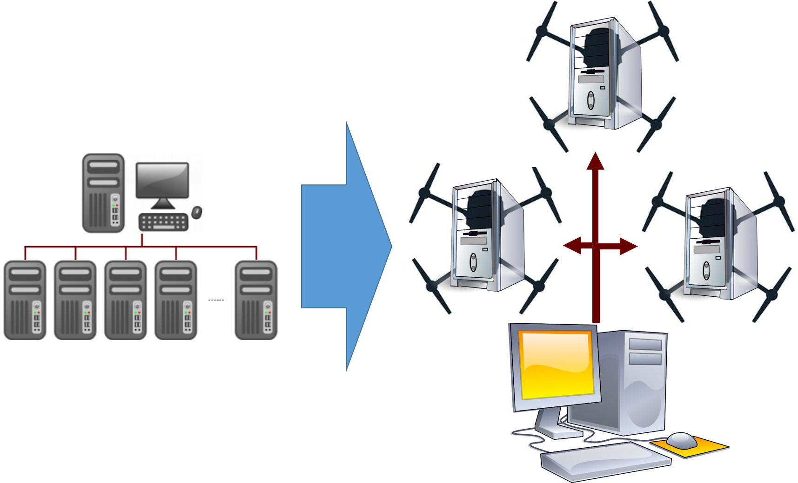
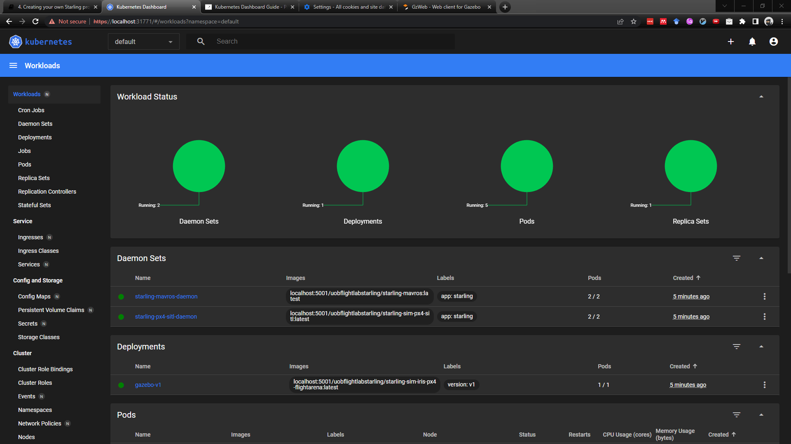
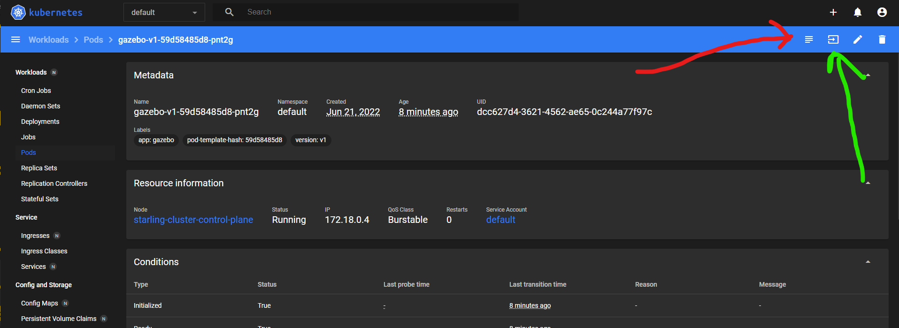

# Multi-UAV flight with Kubernetes for container deployment

In this tutorial we will be introducing the idea of container deployment and why that fits into the goals of what Starling is trying to achieve. We will then show how to run the multi-drone cluster simulation enviornment ready for further multi-drone local development and testing.

Now, I know what you might not be thinking at this point- "Oh great, yet another layer of complexity to learn... grumble grumble" - but alas! wait a minute, we strongly believe that this step is what sets Starling apart from other methodlogies and workflows, and hopefully you'll have an idea of that in the next two tutorials!

[TOC]

## Kubernetes, Multi-UAV Flight and Integration Testing

It certainly is true that we could conduct multi-uav simulation testing with the docker and docker-compose tools that we already have (in fact we have a number [here](https://github.com/StarlingUAS/Murmuration/tree/main/docker-compose/px4)), but this runs into a problem. How do we transition from simply running our developed controller against a simulation, to developing, validating and testing a controller which will be deployed on real hardware?

### Multi-UAV Flight




### Container Orchestration and Kubernetes


### Integration Testing with KinD


## Running the Multi-UAV Simulator

### Installing Mumuration and Starling CLI

You will need to download the [Murmuration repository](https://github.com/StarlingUAS/Murmuration) which contains a useful command line interface (cli). This can hopefully abstract away the need to remember all of the different commands.

To install, go to your work directory and clone the repository using the command line or gui and run the following commands:

```bash
git clone https://github.com/StarlingUAS/Murmuration.git # clones locally
cd Murmuration
```

In the bin directory of the repository, there is the core cli script named `starling`. `starling` includes a further installation script to help install further requirements. This installation script will need to be run using root. See the following guide on which arguments you should give.

Then to finish the installation run:

```bash
sudo starling install
# or if you have not added starling to path and are in the Murmuration directory.
sudo ./bin/starling install
```

> If running within Murmuration, swap `starling` for `./bin/starling`. However for convenience, you can put `starling` onto your path. This can be done by adding `export PATH=<Path to murmuration>/bin:$PATH` into `~/.bashrc` followed by `source ~/.bashrc` , or running the same command locally in the terminal. Then you can use the `starling`

With this you have the starling cli which incorporates the most used functionality of running Starling UAV systems. You can see the available commands like so

```console
> starling help
starling

Starling CLI

Usage: starling [command]

Commands:

  deploy	Starts Starling Server
  install	Installs Base Starling Dependencies
  simulator	Starts Starling Server
  start	Starts Starling Server
  status		Starts Starling Server
  stop		Stops Starling Server
  utils		Utility functions
  *		Help
```

### Running the Multi-Drone Cluster

Start a cluster of 2 drones.

```bash
starling start kind -n 2
```

Once the cluster has started, we can start the general UAV simulator.

> **IMPORTANT**: The simulator can potentially be resource heavy to run. This is with respect to both CPU usage and RAM. Before going further, please ensure you have enough space on your primary drive (at least 30Gb to be safe, especially C drive on windows). This is especially true if running multiple vehicles. It is not recommended to run more than around 6.

First we should load or download the required simulation containers locally. This can be done using the follwoing command. We need to run the load command as we want to load the local container images into the kind container. This avoids the need for the kind containers to download the containers themselves at each runtime.

> This command can take as long as 30 minutes depending on internet connection. It goes through the deployment files and downloads a couple of large containers e.g. the gazebo and sitl containers.

> If the container doesn't already exist locally, it will attempt to download it from docker hub

```
starling simulator load
```

> *Note:* The `--brl` option automatically loads up the BRL flight arena simulated doubles

```bash
starling simulator load --brl
```

Then once downloaded and loaded (this might take a minute), you can start the simulator using the `start` command.

```bash
starling simulator start --brl
# or both load and start at once
starling simulator start --brl --load
```

With an output like the following:

```text
Starting simulator
Converting to use local registry at localhost:5001
deployment.apps/gazebo-v1 created
Converting to use local registry at localhost:5001
daemonset.apps/starling-px4-sitl-daemon created
Converting to use local registry at localhost:5001
daemonset.apps/starling-mavros-daemon created
```

With any luck, this should again open up the simulator on [`localhost:8080`](http://localhost:8080) (no UI yet though we havent started it).

### Monitoring the cluster

A dashboard can be started to monitor the state of your current cluster.

```console
starling start dashboard
```

This will start up the [kubernetes dashboard](https://kubernetes.io/docs/tasks/access-application-cluster/web-ui-dashboard/). To access the dashboard, open up a browser and go to https://localhost:31771.

> Note the browser may not like the security, we promise it is safe to access! If you click 'advanced options' and 'continue to website' you should be able to access the website.

To log on, the above command should show something like the following:

```console
The Dashboard is available at https://localhost:31771
You will need the dashboard token, to access it.
Copy and paste the token from below
-----BEGIN DASHBOARD TOKEN-----
<LONG TOKEN>
-----END DASHBOARD TOKEN-----
Note: your browser may not like the self signed ssl certificate, ignore and continue for now
To get the token yourself run: kubectl -n kubernetes-dashboard describe secret admin-user-token
```

You can copy the `<LONG TOKEN>` and paste it into the dashboard token. You can also get the access token again by running:

```
starling utils get-dashboard-token
```


> For a more specific tutorial on the dashboard [go to this page in the starling docs](https://docs.starlinguas.dev/details/kubernetes-dashboard/)!

This web dashboard shows you all of statuses of all things within the simulated cluster you have started. It can be rather overwhelming, but you'll be thankful knowing that in general you only need to interact with a few elements. Once you open the dashboard you are on the workloads page, this just gives you an overview of everything that is running. If it's green you're all good!



You can see the nodes in the cluster by scrolling down on the left side bar and clicking nodes. Here we see the server (control plane) and 2 drones (workers)


On the right side bar the **pods** button brings you to a list of all the groups of containers (pods) running on the cluster right now. We can see 1 gazebo pod, 2 px4 and 2 mavros, representing two drones and a simulator.


Finally you can click on any one of the pods to access that containers logs, as well as exec into them if you want to run stuff.



> Navigate around and have a look at the running pods, see if you recognised some of the printouts from when you just ran docker-compose.

> *Note:* The dashboard is definitely overspecified for our needs, but it already existed and was a good resource. We have a project which is all about building an equivalent replacement which suits our needs!

Finally, for very quick diagnostics, you can also monitor the system using.

```consle
$ starling status
# or to continually watch
$ starling status --watch

Number of vehicles: 2
Nodes:
NAME                             STATUS   ROLES                  AGE   VERSION
starling-cluster-control-plane   Ready    control-plane,master   38m   v1.21.1
starling-cluster-worker          Ready    <none>                 38m   v1.21.1
starling-cluster-worker2         Ready    <none>                 38m   v1.21.1
Pods:
NAME                             READY   STATUS    RESTARTS   AGE
gazebo-v1-59d58485d8-pnt2g       1/1     Running   0          25m
starling-mavros-daemon-cqjhr     1/1     Running   0          25m
starling-mavros-daemon-nmptj     1/1     Running   0          25m
starling-px4-sitl-daemon-fllq5   1/1     Running   0          25m
starling-px4-sitl-daemon-gfxqs   1/1     Running   0          25m
Deployments:
NAME        READY   UP-TO-DATE   AVAILABLE   AGE
gazebo-v1   1/1     1            1           25m
StatefulSets:
No resources found in default namespace.
DaemonSets
NAME                       DESIRED   CURRENT   READY   UP-TO-DATE   AVAILABLE   NODE SELECTOR               AGE
starling-mavros-daemon     2         2         2       2            2           starling.dev/type=vehicle   25m
starling-px4-sitl-daemon   2         2         2       2            2           starling.dev/type=vehicle   25m
```

### Restarting on Stopping the Simulator

So to recap, there are two parts to our Starling integration test simulator. There is the cluster, and then there is our uav simulation running within the cluster.

If the UAV simulation seems to broken or you have put it in an unrecoverable state, you can restart the UAV simulation without deleting the cluster, simply by using the `restart` command with the simulator:

```console
starling simulator restart --brl
```

> *Note:* This will stop the simulator by deleting all deployments within the cluster, and the restart. You can remove all deployments by using `starling simulator stop`.

> *Note:* Dont forget to include the `--brl` so it knows what to start up again.

If you have finished testing for the day, something fundamental to the cluster has gone wrong (e.g. failed to connect to ports, networking etc), or you wish to change the number of drones in your cluster, you can stop and delte the cluster and everything in it by running.

```console
starling stop kind
```

> *Note:* This will remove all of the loaded internal images again, so you will need to load them in next time you start the cluster. (However there is an option of `--keep_registry`).

> *Note:* You will have to start everything up again after restarting - dashboard, load images, start brl simulator.

## Next Steps
